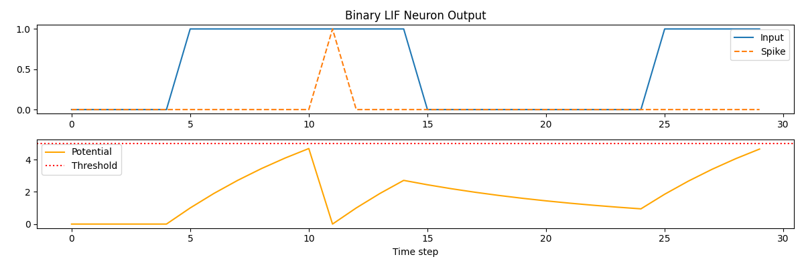
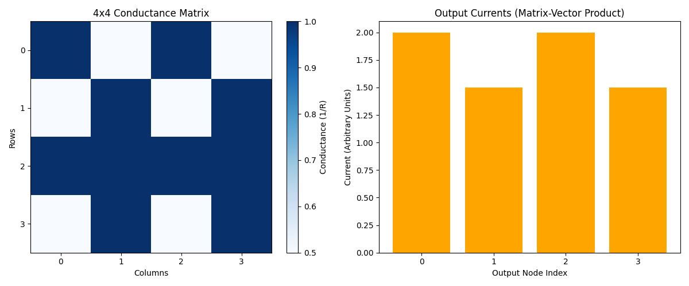

# Week 6 Challenge – ECE 410/510 – Neuromorphic Computing Simulations

This repository contains Python implementations of two neuromorphic computing challenges for ECE 410/510 (Spring 2025). Both projects simulate brain-inspired components using NumPy and Matplotlib, making them intuitive for beginners in hardware modeling and neural dynamics.

---

## 📁 Contents

- `lif_neuron.py` – Binary Leaky Integrate-and-Fire (LIF) Neuron simulation.
- `crossbar_sim.py` – Crossbar Matrix-Vector Multiplication using conductance mapping.
- `lif_neuron_graph.png` – Plot showing LIF neuron potential and spike behavior.
- `crossbar_sim_graph.png` – Heatmap and bar chart of conductance and output currents.
- `output.png` – Additional output visualizations (if applicable).
- `w6_challenge_documentation.docx` – Full implementation log with questions, results, and explanations.

---

## 🔬 Challenge Summaries

### 1. Binary LIF Neuron (`lif_neuron.py`)
This script simulates a binary LIF neuron using:
- A **leak factor** (λ) for decaying potential.
- A **threshold** (θ) for spiking.
- Reset logic on firing events.

#### Example:
```python
inputs = [0]*5 + [1]*10 + [0]*10 + [1, 1, 1, 1, 1]
spikes, potentials = binary_lif_neuron(inputs)
```

#### Visualization:
- Input signals and spikes over time.
- Membrane potential evolution with threshold line.



---

### 2. Crossbar Matrix-Vector Multiplication (`crossbar_sim.py`)
Simulates a 4x4 resistive crossbar by:
- Converting resistance `R` to conductance `G = 1/R`.
- Performing a dot product: `G.T @ Input_Vector`.

#### Example Output:
```
Conductance Matrix:
 [[1.   0.5  1.   0.5 ]
  [0.5  1.   0.5  1.  ]
  [1.   1.   1.   1.  ]
  [0.5  1.   0.5  1.  ]]
Input Vector:
 [1 0 1 0]
Output Currents:
 [2.  1.5 2.  1.5]
```

#### Visualization:
- Heatmap of the conductance matrix.
- Bar chart of resulting output currents.



---

## ⚙️ How to Run

### 1. Install dependencies
```bash
pip install numpy matplotlib
```

### 2. Run LIF Neuron
```bash
python lif_neuron.py
```

### 3. Run Crossbar Simulation
```bash
python crossbar_sim.py
```

---

## 📘 Documentation

For detailed explanation, evolution of code, and all Q&A:
- 📄 `w6_challenge_documentation.docx` summarizes the entire coding journey.
- Includes visual debugging, plotting enhancements, and scale-up from 4x4 to 8x8 matrices.

---

## 💡 Educational Value

- Demonstrates fundamental neuromorphic concepts.
- Bridges analog computation (resistive crossbars) with digital simulation.
- Explains time-dynamic behavior of simple spiking neurons.

---

## 🧠 Author

Badhrinadh Alladurgam  
ECE 410/510 – Portland State University  
Spring 2025
